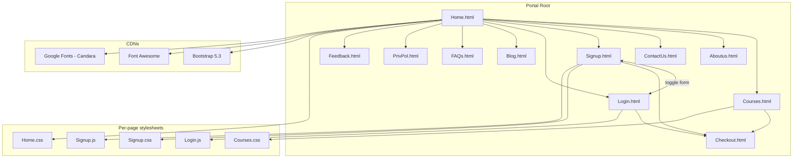

# 🎓 AcademiaNest Portal

A static, multi-page marketing website for the fictional **Academia Nest** learning platform — a full-bleed landing page, course catalog, blog, team showcase, and account/checkout/feedback flows. Built as a Semester-1 ICT project in pure **HTML5 + CSS3 + vanilla JavaScript** with **Bootstrap 5** and **Font Awesome** pulled from CDNs. No build step, no framework, no backend — open it in a browser and it works.

---

## ✨ Features

| Area | Detail |
|---|---|
| Pages | **Home** (landing + featured courses), **Courses** (catalog grid), **Blog** (curated links), **About Us** (team), **Contact Us** (form + map), **FAQs**, **Privacy Policy**, **Checkout** (cart summary), **Feedback**, **Sign Up**, **Login** |
| Design system | Per-page CSS files sharing a common vocabulary (dark header, CTA buttons, card grids, fade-in / slide-up animations), Bootstrap 5.3 grid + navbar, Google Fonts (Candara) |
| Navigation | Shared sticky navbar with brand logo (`academia.png`), 7 nav items, and a 3-column footer (Services / Get Help / social icons) repeated on every page |
| Form UX | **Signup.js** — client-side validation: email regex check, password ↔ confirm-password match, and a toggle link that swaps the Sign Up / Log In forms in place; **Login.js** — email-format validation with alert feedback |
| Content | 16 course/blog images (`P1.jpg`–`P16.jpg`), team headshots (Abdullah, Ahmed, Ayaan, Issa, Nashwa), all referenced relatively from the page root |

### Page → asset map

| Page | CSS | JS | Notable content |
|---|---|---|---|
| `Home.html` | `Home.css` | — | Hero, 3 featured courses → Checkout, CTA to Courses |
| `Courses.html` | `Courses.css` | — | Course grid (`P*.jpg`) |
| `Blog.html` | `Blog.css` | — | Blog article cards/links |
| `Aboutus.html` | `Aboutus.css` | — | Team member cards |
| `ContactUs.html` | `ContactUs.css` | — | Contact form + map embed |
| `FAQs.html` | `FAQs.css` | — | FAQ list |
| `PrivPol.html` | `PrivPol.css` | — | Privacy policy text |
| `Checkout.html` | `Checkout.css` | — | Static cart/checkout summary |
| `Feedback.html` | `Feedback.css` | — | Feedback form |
| `Signup.html` | `Signup.css` | `Signup.js` | Dual sign-up/login form with validation |
| `Login.html` | `Login.css` | `Login.js` | Login form with email validation |

---

## 🏗 Architecture

Static multi-page site with **relative inter-page linking** and a **per-page style sheet**; there is no SPA router and no server-side logic.



### Client-side validation flow (Signup / Login)

```mermaid
flowchart LR
    A[Form submit] -->|preventDefault| B{Email matches<br/>/^[^\\s@]+@[^\\s@]+\\.[^\\s@]+$/?}
    B -- no --> E[Alert: invalid email]
    B -- yes --> C{Password<br/>fields present?}
    C -- no --> D[Alert: Log In Successful]
    C -- yes --> F{Passwords<br/>match?}
    F -- no --> G[Alert: do not match]
    F -- yes --> D2[Alert: Sign Up Successful]
```

---

## 🚀 Getting started

No build step and no dependencies to install.

**Option 1 — open directly**

Double-click `Home.html` (or any page). All internal links are relative, so every page works.

**Option 2 — local static server**

```bash
# from this directory
python -m http.server 8000
# then visit: http://localhost:8000/Home.html
```

**Option 3 — VS Code Live Server**

Open the folder in VS Code and use the *Live Server* extension on `Home.html`.

## 📁 Repository layout

```
├── Home.html / Courses.html / Blog.html / Aboutus.html / ContactUs.html
├── FAQs.html / PrivPol.html / Checkout.html / Feedback.html
├── Signup.html / Login.html          # pages
├── *.css                             # one stylesheet per page
├── Signup.js / Login.js              # client-side form validation
├── academia.png                      # brand logo
├── P1.jpg … P16.jpg                  # course & blog imagery
├── abdullah.jpg, ahmed.jpg, aayan.jpg, issa.jpg, nashwa.jpg   # team
└── map.osm                           # OSM extract (reference asset)
```

## 🔧 Development notes

- **Links are relative** — all inter-page `href`s are bare filenames, so the site is portable to any host path.
- **Forms are static**: submissions call `event.preventDefault()` and show an `alert()`; there is no persistence.
- **CDN dependencies**: Bootstrap 5.3 and Font Awesome (4/5) load from jsDelivr/cdnjs; an internet connection is required for the navbar, icons, and typography.
- **Images** live next to the pages; keep them in the same folder if you reorganize.

## 📄 License

MIT
